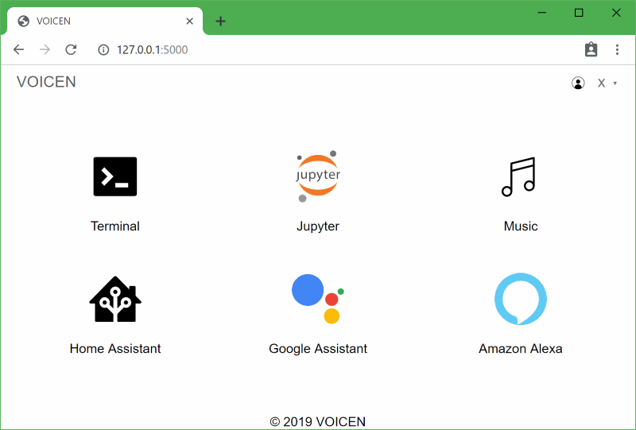

VOICEN DEVICE WEB
=================

The web app for VOICEN devices, built with Flask and Purecss.




### Run
```
pip install flask python-pam
FLASK_APP=app.py flask run
```

### Credits
+ [Flask](https://github.com/pallets/flask)
+ [Purecss](https://purecss.io/)
+ Icons from [iconfont.cn](https://iconfont.cn) and [wikipedia](https://commons.wikimedia.org)
